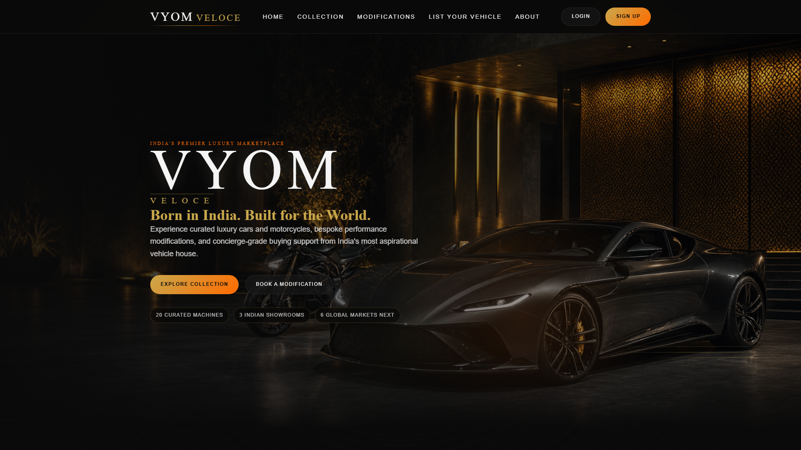

# VYOM Veloce

India's premier luxury vehicle marketplace: **Born in India. Built for the World.**

VYOM Veloce is a full-stack portfolio project for curated luxury cars and motorcycles, premium seller onboarding, bespoke modification requests, admin inventory management, and Razorpay-powered booking deposits. The latest redesign adds a cinematic black/gold Indian-luxury visual system, generated brand imagery, refined loading/error states, custom controls, and a more polished marketplace experience.



## Live Demo

- Production: https://vyom-veloce.vercel.app

## Highlights

- Cinematic homepage with animated brand lockup, generated hero imagery, featured inventory rail, showroom previews, international expansion artwork, and modification studio preview.
- Collection experience with search, branded custom dropdown filters, generated vehicle visuals for known inventory, and Pexels fallback for future/unmapped listings.
- Vehicle profile pages with full-vehicle gallery framing, INR pricing, category/origin badges, buyer validation, Razorpay 40% booking flow, and animated confirmation artwork.
- Modification studio with generated car/bike package visuals, a clear four-step explanation, and an accessible consultation form.
- Seller listing flow with inline validation and AI-assisted media positioning that keeps any future generation key server-side.
- About page with Indian heritage/global luxury storytelling, generated showroom/location visuals, mission blocks, and expansion roadmap.
- Auth and admin dashboard with Supabase email/password auth, protected admin route, CRUD inventory tools, request review, metric cards, and improved SaaS-style states.
- Global error boundary, skeleton loaders, premium empty/error notices, custom cursor on pointer devices, mobile navigation, and responsive UI polish.

## Tech Stack

- React 19 + Vite 8
- React Router 7
- Tailwind CSS v4 through `@tailwindcss/vite`
- Framer Motion
- Supabase database + auth
- Razorpay checkout
- Pexels API as progressive image fallback
- Vercel SPA deployment with `vercel.json` rewrites

## Generated Visual System

Project-owned raster assets live under `src/assets/generated/`:

- `vehicles/`: generated visuals mapped to the current Supabase inventory.
- `modifications/`: generated visuals for international and Indian modification packages.
- `showrooms/`: Delhi, Bangalore, and Ghaziabad showroom visuals.
- `about/`: brand story, atelier craft, global vision, heritage vision, and international expansion visuals.

The resolver in `src/lib/generatedVisuals.js` prefers generated local visuals first, then Pexels, then the generic fallback image. This keeps current inventory visually cohesive while still supporting new future Supabase listings.

## Environment Variables

Create `.env` in the project root:

```bash
VITE_SUPABASE_URL=https://your-project-ref.supabase.co
VITE_SUPABASE_ANON_KEY=your-supabase-anon-key
VITE_PEXELS_API_KEY=your-pexels-api-key
VITE_RAZORPAY_KEY_ID=rzp_test_xxxxxxxxxx
VITE_ADMIN_EMAIL=admin@vyomveloce.com
```

Do not expose any generative AI API key in the Vite client. If listing-image generation is added later, put it behind a server-side endpoint or Supabase Edge Function with rate limits and environment secrets.

## Supabase Setup

1. Create a Supabase project.
2. Run `supabase/schema.sql` in the SQL Editor.
3. Enable email/password auth.
4. For quick local demos, disable email confirmation so new users get an immediate session.
5. Set `VITE_ADMIN_EMAIL` to the email that should access `/admin`.

## Local Development

Install dependencies:

```bash
npm install
```

Start Vite:

```bash
npm run dev
```

Run lint:

```bash
npm run lint
```

Build for production:

```bash
npm run build
```

Preview the production build:

```bash
npm run preview
```

## Deployment

1. Push the repo to GitHub.
2. Import it into Vercel.
3. Add all `VITE_*` variables from `.env.example`.
4. Deploy. Client-side routing is handled by `vercel.json`.

## Notes

- The build can warn about large image and JavaScript chunks because the app includes many generated PNG assets. The warning is not a failed build; image compression/code splitting would be the next optimization pass.
- Pexels results are cached in `localStorage` for 24 hours.
- Razorpay currently collects a 40% booking amount and shows the remaining 60% as payable at physical handover.
- Generated inventory images are illustrative brand-owned visuals, while real listing data still comes from Supabase.
